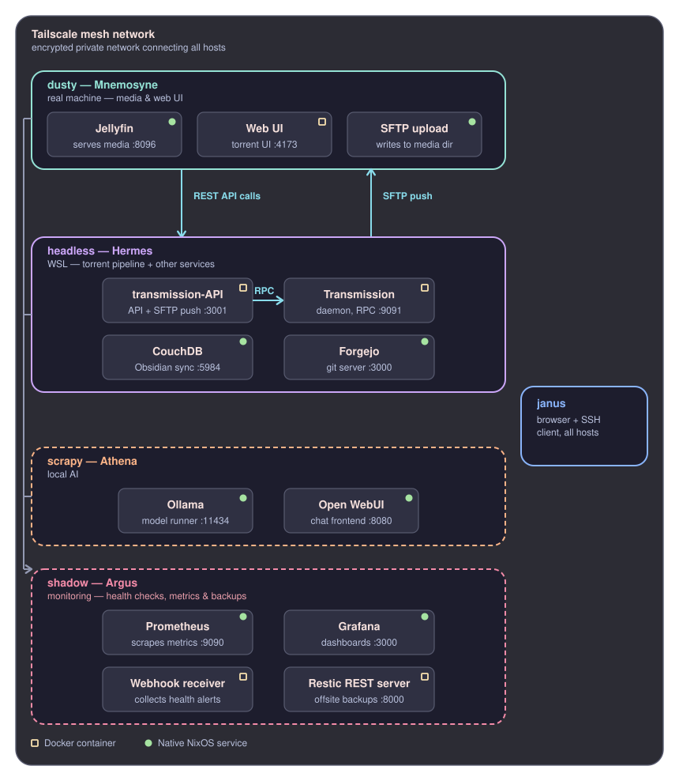

# NixOS Multi-Machine Server Config (Jellyfin + Doom Emacs + Tailscale + Docker + SFTP + Local AI)

Multiple machine profiles from one repo — Jellyfin, Tailscale (with Tailscale SSH), Docker, chrooted SFTP, CouchDB-backed Obsidian sync, a self-hosted git server, local AI models (Ollama + Open WebUI), n8n, Prometheus/Grafana monitoring, a Hyprland desktop, Samba, and Doom Emacs — all locked down to your tailnet, deployable to real machines or NixOS-WSL, choosing which services each machine runs.



Currently five hosts: `dusty` (Jellyfin, SFTP), `headless` (Obsidian + git server + n8n, WSL), `scrapy` (local AI, WSL), `shadow` (monitoring hub), `headfull` (Hyprland desktop).

Full documentation lives in [`doc/`](./doc/overview.md):

- **[doc/overview.md](./doc/overview.md)** — start here: architecture, repository layout, file-by-file breakdown
- **[doc/hosts.md](./doc/hosts.md)** — the multi-host system: adding a machine, choosing its services, install-time selection
- **[doc/configuration.md](./doc/configuration.md)** — `hosts/defaults.nix` + per-host `vars.nix` reference, design assumptions
- **[doc/deploy-real-machine.md](./doc/deploy-real-machine.md)** — installing a real-machine host
- **[doc/deploy-wsl.md](./doc/deploy-wsl.md)** — installing a NixOS-WSL host
- **[doc/boot-and-updates.md](./doc/boot-and-updates.md)** — what auto-starts at boot, and how to apply future changes on each machine
- **[doc/first-boot-setup.md](./doc/first-boot-setup.md)** — one-time setup: Tailscale, Jellyfin, Obsidian sync, SFTP, Docker, Doom Emacs, shell helpers
- **[doc/headfull-keybinds.md](./doc/headfull-keybinds.md)** — Hyprland keyboard shortcuts for the headfull desktop

## Quick start
```bash
git clone <your-dotfiles-repo-url> ~/dotFiles
cd ~/dotFiles
./scripts/install.sh dusty        # or headless, scrapy, shadow, headfull — pick the host you're deploying
sudo nixos-rebuild switch --flake /etc/nixos#dusty
./scripts/post-install.sh
```
See [doc/hosts.md](./doc/hosts.md) for the full multi-host reference, and the deploy guides above for first-time setup on a fresh machine.

## Checking everything's actually reachable
`check-remote.sh` runs from **any client device on your tailnet** (your laptop, phone via Termux, etc.) — not the server itself — and tests SSH, SFTP, Jellyfin, CouchDB, and optionally Samba all in one go:
```bash
./scripts/check-remote.sh --host dusty
```
See [doc/first-boot-setup.md](./doc/first-boot-setup.md) for full usage and flags.